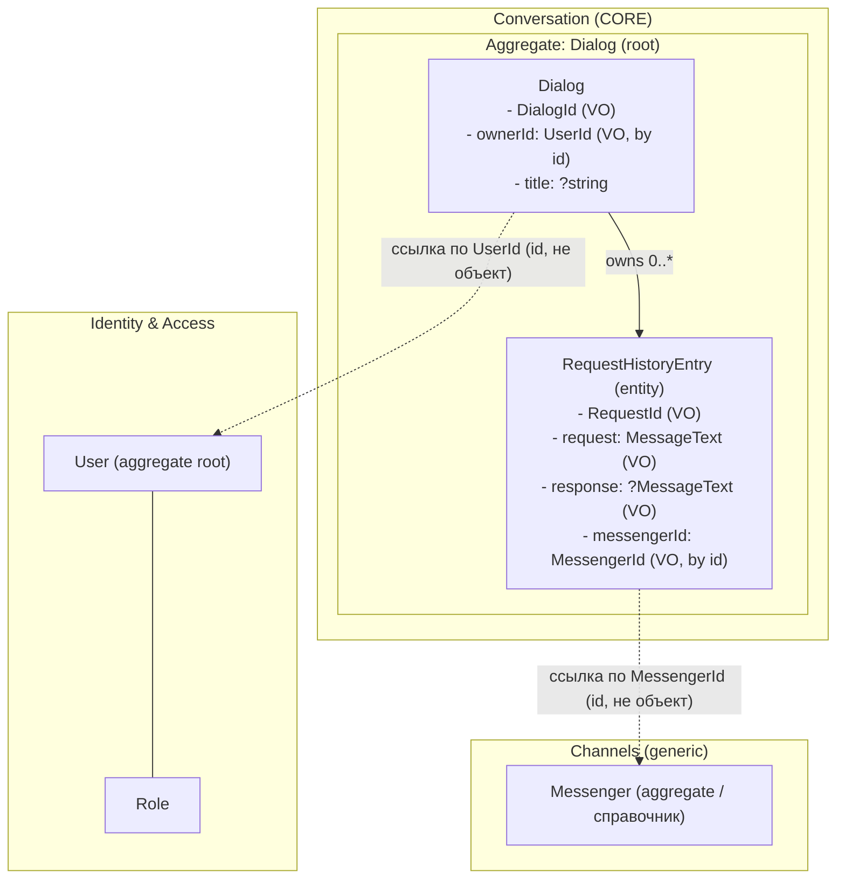

# DDD: поддомены и агрегаты чат-агрегатора

Приложение — **чат-агрегатор**: пользователь ведёт диалоги с AI-ассистентом
через мессенджеры, система хранит историю запросов и ответов.

## 1. Поддомены

| Поддомен | Тип | Назначение | Сущности/модели |
|----------|-----|------------|-----------------|
| **Identity & Access** | supporting | Кто пользователь и что ему разрешено | `User`, `Role` |
| **Conversation** | **CORE** | Диалоги пользователя с ассистентом и история обмена сообщениями | `Dialog` (агрегат-корень), `RequestHistoryEntry` (сущность внутри агрегата) |
| **Content** | supporting | Статический/справочный контент (страницы) | `Page` |
| **Channels** | generic | Справочник каналов-мессенджеров | `Messenger` |

**Почему так.** Ядро ценности продукта — переписка с ассистентом и её
история, поэтому **Conversation** выделен как core-домен и реализован в
DDD-стиле. Идентификация и права — поддерживающий поддомен (нужен, но не
является конкурентным преимуществом). Каналы-мессенджеры — generic: это
обычный справочник, легко заменяемый. Контент-страницы — отдельная
поддерживающая область, не связанная с логикой диалогов.

## 2. Агрегаты и их границы

### Conversation → `Dialog` (агрегат-корень)

Граница агрегата охватывает сам диалог и принадлежащие ему записи истории.
Записи (`RequestHistoryEntry`) **не существуют и не изменяются** вне корня —
любая мутация проходит через методы поведения `Dialog`.



Пунктирные стрелки — ссылки **только по идентификатору** (Value Object),
без объектных ссылок между агрегатами.

ASCII-вариант границы агрегата `Dialog`:

```
+--------------------------------------------------------+
|  Aggregate root: Dialog                                |
|  - id        : DialogId (VO)                           |
|  - ownerId   : UserId   (VO)  --> ссылка на User по id |
|  - title     : ?string                                 |
|                                                        |
|   requests[] (внутри границы агрегата):                |
|   +------------------------------------------------+   |
|   | RequestHistoryEntry (entity)                   |   |
|   |  - id          : RequestId  (VO)               |   |
|   |  - request     : MessageText(VO)               |   |
|   |  - response    : ?MessageText(VO)              |   |
|   |  - messengerId : MessengerId(VO) --> Messenger |   |
|   +------------------------------------------------+   |
+--------------------------------------------------------+
        ^ изменения только через методы корня:
          start(), addRequest(), attachResponseToLatest()
```

### Инварианты агрегата `Dialog`

- Диалог всегда создаётся в корректном состоянии через фабрику
  `Dialog::start(DialogId, UserId, ?title)`: есть идентичность и владелец.
- Владелец задаётся один раз и хранится как `UserId` (id другого агрегата),
  а не как объект `User`.
- Новые записи добавляются только методом `addRequest()` — внешний код не
  может вставить «сырую» запись в коллекцию (геттер `requests()` возвращает
  копию).
- Ответ к запросу можно прикрепить **ровно один раз**
  (`RequestHistoryEntry::attachResponse()` бросает `DomainException` при
  повторе); ответ нельзя прикрепить, если нет ни одного запроса.
- Текст сообщения (`MessageText`) не может быть пустым и не длиннее
  `MAX_LENGTH` символов — инвариант проверяется в конструкторе VO, поэтому
  невалидный текст в принципе не может попасть в агрегат.

### Identity & Access → `User` (агрегат-корень)

Границей владеет `User`; роли (`Role`) — связанная справочная сущность.
Conversation ссылается на пользователя только по `UserId`.

### Channels → `Messenger`

Справочник каналов. В Conversation присутствует только как `MessengerId`.

### Content → `Page`

Независимый агрегат справочного контента, не пересекается с диалогами.

## 3. Value Objects (поддомен Conversation)

| VO | Инвариант | Назначение |
|----|-----------|-----------|
| `DialogId` | положительный int | идентичность диалога |
| `UserId` | положительный int | ссылка на агрегат User по id |
| `MessengerId` | положительный int | ссылка на канал по id |
| `RequestId` | null или положительный int | идентичность записи истории (null = ещё не сохранена) |
| `MessageText` | не пусто, ≤ 10000 символов | текст запроса/ответа |

Все VO: `final readonly`, без сеттеров, валидируют инвариант в конструкторе,
сравниваются методом `equals()`, значение читается через `value()`.

## 4. Как Eloquent-модель «переделана в агрегат»

- Доменная логика и инварианты вынесены в чистый PHP-класс
  `App\Domain\Conversation\Dialog` (не наследует Eloquent).
- Хранение — деталь за репозиторием:
  `App\Domain\Conversation\DialogRepository` (интерфейс) +
  `App\Infrastructure\Conversation\EloquentDialogRepository` (маппинг
  агрегат ↔ Eloquent-модели `Dialog`/`RequestHistory`).
- Биндинг интерфейс → реализация — в `AppServiceProvider::register()`.
- Eloquent-модели остаются исключительно как persistence-слой.
